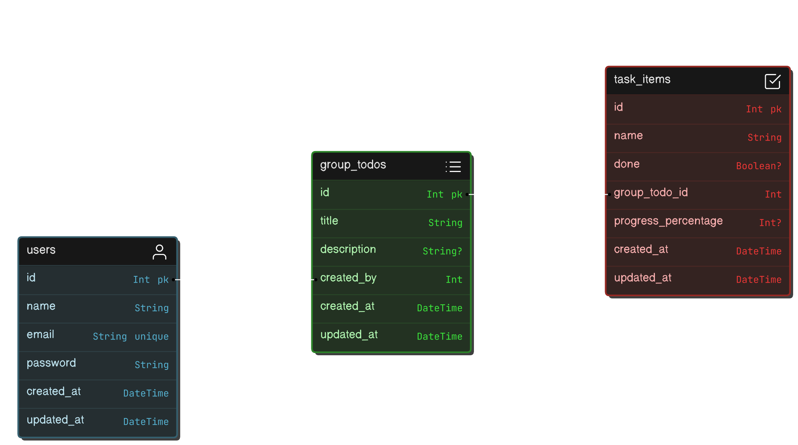

# Kanban Board API

This project is a RESTful API for a Kanban board application, built with Express.js, Prisma and TypeScript. It provides endpoints for user authentication, managing todo groups, and handling individual tasks within those groups.



## Features

### User Authentication

#### Register User

- **URL**: `/api/users/register`
- **Method**: `POST`
- **Request Body**:
  ```json
  {
    "name": "John Doe",
    "email": "john@example.com",
    "password": "password123"
    "password_confirmation":"password123"
  }
  ```
- **Success Response**:
  - **Code**: 201
  - **Content**:
    ```json
    {
      "status_code": 201,
      "message": "User registered successfully",
      "data": {
        "user_id": 1,
        "name": "John Doe",
        "email": "john@example.com"
      }
    }
    ```
- **Error Response**:
  - **Code**: 400
  - **Content**:
    ```json
    {
      "errors": [
        {
          "msg": "Invalid value",
          "param": "email",
          "location": "body"
        }
      ]
    }
    ```

#### Login User

- **URL**: `/api/users/login`
- **Method**: `POST`
- **Request Body**:
  ```json
  {
    "email": "john@example.com",
    "password": "password123"
  }
  ```
- **Success Response**:
  - **Code**: 200
  - **Content**:
    ```json
    {
      "status_code": 200,
      "message": "Login successful",
      "data": {
        "user_id": 1,
        "name": "John Doe",
        "email": "john@example.com",
        "jwt": "token"
      }
    }
    ```
- **Error Response**:
  - **Code**: 401
  - **Content**:
    ```json
    {
      "message": "Invalid credentials"
    }
    ```

### Todo Groups

#### Get All Todo Groups

- **URL**: `/api/todos`
- **Method**: `GET`
- **Headers**:
  - Authorization: Bearer [JWT_TOKEN]
- **Success Response**:

  - **Code**: 200
  - **Content**:

    ```json
    {
      "status_code": 200,
      "meesage": "Todos fetched successfully",
      "data": [
        {
          "id": 1,
          "title": "Group Task 1",
          "created_by": "1",
          "created_at": "2021-04-20T23:47:50.046Z",
          "updated_at": "2021-04-20T23:47:50.046Z"
        },
        {
          "id": 2,
          "title": "Group Task 2",
          "created_by": "1",
          "created_at": "2021-04-21T00:04:23.906Z",
          "updated_at": "2021-04-21T00:04:23.906Z"
        }
      ]
    }
    ```

- **Error Response**:
  - **Code**: 500
  - **Content**:
    ```json
    {
      "message": "Error fetching todos"
    }
    ```

#### Create New Todo Group

- **URL**: `/api/todos`
- **Method**: `POST`
- **Headers**:
  - Authorization: Bearer [JWT_TOKEN]
  - Content-Type: application/json
- **Request Body**:
  ```json
  {
    "title": "Group Task 6",
    "description": "July - September"
  }
  ```
- **Success Response**:
  - **Code**: 201
  - **Content**:
    ```json
    {
      "status_code": 201,
      "message": "Todo group created successfully",
      "data": {
        "id": 1,
        "title": "Group Task 6",
        "description": "July - September"
      }
    }
    ```
- **Error Response**:
  - **Code**: 400
  - **Content**:
    ```json
    {
      "errors": [
        {
          "msg": "Title is required",
          "param": "title",
          "location": "body"
        }
      ]
    }
    ```

### Task Item

#### Create new task

- **URL**: `api/todos/:group_id/items`
- **Method**: `POST`
- **Headers**:
  - Authorization: Bearer [JWT_TOKEN]
  - Content-Type: application/json
- **Request Body**:
  ```json
  {
    "name": "Name of new task",
    "progress_percentage": 60
  }
  ```
- **Success Response**:

  - **Code**: 201
  - **Content**:

    ```json
    {
      "status_code": 201,
      "message": "Task created successfully",
      "data": {
        "id": 1,
        "name": "Name of new task",
        "done": null,
        "group_todo_id": 1,
        "created_at": "date",
        "updated_at": "date",
        "progress_percentage": 60
      }
    }
    ```

#### Get All Task Todo Groups

- **URL**: `/api/todos/:group_id/items`
- **Method**: `GET`
- **Headers**:
  - Authorization: Bearer [JWT_TOKEN]
- **Success Response**:

  - **Code**: 200
  - **Content**:

    ```json
    {
      "status_code": 200,
      "message": "Task items fetched successfully",
      "data": [
        {
          "id": 1,
          "name": "Name of new task",
          "done": null,
          "group_todo_id": 1,
          "created_at": "date",
          "updated_at": "date",
          "progress_percentage": 60
        }
      ]
    }
    ```

#### Patch Task Item

- **URL**: `/api/todos/:group_id/items/:task_item_id`
- **Method**: `PATCH`
- **Headers**:
  - Authorization: Bearer [JWT_TOKEN]
- **Success Response**:

  - **Code**: 200
  - **Content**:

    ```json
    {
      "status_code": 200,
      "message": "Task updated successfully",
      "data": {
        "id": 1,
        "name": "Name of new task",
        "done": null,
        "group_todo_id": 1,
        "created_at": "date",
        "updated_at": "date",
        "progress_percentage": 80
      }
    }
    ```

#### Delete Task Item

- **URL**: `/api/todos/:group_id/items/:task_item_id`
- **Method**: `DELETE`
- **Headers**:
  - Authorization: Bearer [JWT_TOKEN]
- **Success Response**:

  - **Code**: 200
  - **Content**:

    ```json
    {
      "status_code": 200,
      "message": "Task deleted successfully"
    }
    ```

## Setup and Installation

To clone and run this website, you'll need [Git](https://git-scm.com) and [Node.js](https://nodejs.org/en/download/) (which comes with [npm](https://www.npmjs.com)) installed on your computer. From your command line:

```bash
# Clone this repository
$ git clone https://github.com/rizalyoga/simple-kanban-be.git

# Go into the repository
$ cd simple-kanban-be

# Install dependencies
$ npm install

# Run the app
$ npm run dev
```

## Technologies Used

- Node.js
- Express.js
- TypeScript
- Prisma (ORM)
- JSON Web Tokens (JWT) for authentication

## Authors

- [Rizalyoga](https://github.com/rizalyoga/)
